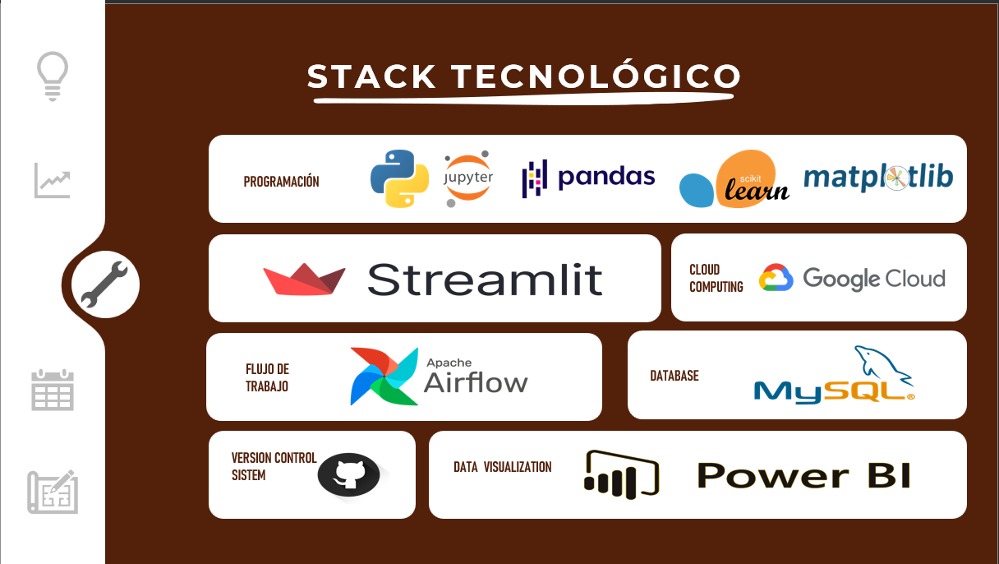

<h1 align="center"> Proyecto grupal: Move Trends  </h1>

   
   

# Tabla de contenidos
* [Introducción](#Introducción)

* [Objetivos](#Objetivos)

* [Solución propuesta](#Solución-propuesta)

* [Desarrollo](#Desarrollo)

* [Informes](#Informes)

* [Producto final](#Producto-final)

* [Deployment](#Deployment)

* [Disclaimer](#Disclaimer)

*Proyecto desarrollado en Henry por:*

| Miembro del equipo | GitHub |Pais
|:-----------:|:-----------:|:-----------:|
| Juan Garcia    | [@juangarciare](https://github.com/juangarciare)   |	align="center">
   
| Camilo Ardila          |  [@kmilo140](https://github.com/kmilo140)         |:colombia:
| Gian Rivas | [@GianArthas](https://github.com/GianArthas)   |:peru:
| Matias Garro          |[@matiasgarroa](https://github.com/matiasgarroa)           |	:argentina:
| Camilo Pedreros   | [@CamiiloP14](https://github.com/CamiiloP14)   |:🇨🇴:

# Introducción
 
 ## contexto 
 Desde medidados del siglo pasado, los flujos migratorios en Suramérica han experimentado un importante aumento debido a una variedad de razones, como la inestabilidad económica, la violencia, el cambio climático y la búsqueda de mejores oportunidades. Este fenómeno ha generado una serie de desafíos y oportunidades para las sociedades de acogida y para los propios migrantes.

## Rol a desarrollar

Una ONG internacional se ha contactado con nuestra empresa de consultoria **Movie Trends**, con el fin de estudiar los flujos migratorios de suramérica y mostrar las principales estadísticas de los países afectados.

# Objetivos

Para afrontar este desafío nos hemos planteado los siguientes objetivos.
## General

* Analizar los patrones y comportamientos asociados a los flujos migratorios en los países de Sudamérica tales como Brasil, Uruguay, Paraguay, Argentina, Colombia y Perú.

## Específicos

* Realizar un análisis comparativo entre los diferentes países de Sudamérica mencionados para identificar las similitudes y diferencias en los flujos migratorios, incluyendo las razones detrás de los movimientos migratorios.
* Crear un mapa interactivo que  indique cuales son los mejores lugares para emigrar y/o inmigrar de acuerdo al país en el que resida el ciudadano.
* Realizar Data Pipeline, para poder implementar una base de datos, para montarlo en un servicio de cloud (google cloud).

* Creación de Dashboards, KPIs y métricas que  enseñen  los principales resultados sobre los factores que influyen en las migraciones.

* Desarrollar un modelo de machine learning que permita a los usuarios predecir el PIB per cápita de los principales países de Sudamérica para el próximo año.

* Producir un repositorio en la plataforma Github, disponiendo el proyecto a la comunidad, para que esta expongan mejoras para futuras versiones del proyecto. 

# Solución propuesta

## Stack tecnológico

   
   

## Metodología de trabajo

* Se usará la metodología SCRUM la cual consiste en llevar a cabo un conjunto de tareas de forma regular con el objetivo de trabajar en forma conjunta.
* Progreso del proyecto dividido en semanas.
* Encuentros diarios del equipo: 8:30 hs ARG por discord
* Encuentros diarios con el Henry Mentor (Marcos Audisio) 13:00 hs ARG por Meet
* Encuentros semanales con el Product owner (Julio)
* Comunicación oficial con HM por Slack
* Comunicación con el equipo por Whatsapp
* Avances del proyecto en repositorio de github

## Entregables

* Semana 1. Propuesta de trabajo
* Semana 2. Documentación
   + Stack elegido y fundamentación
   + Flujo de trabajo
* Semana 3.
   + Dashboards 
   + Modelos de Machine Learning
* Semana 4. Demo final

# Desarrollo

**Semana 1.**

Para iniciar este proyecto se debía tener claro el contexto de los flujos migratorios en sudamérica, los principales factores asociados a la migración, y entender el por qué de estos factores. Para esto como equipo realizamos una investigación de los flujos migratorios en el mundo y con dicha información se realizó un análisis preliminar de estos. Con respecto a los datos dispuestos para realizar el proyecto, principalmente se obtuvieron de la API del banco mundial y de la OCDE.  Una vez que se tenía claro lo que eran los flujos migratorios y el contexto del problema, nos dispusimos a plantear los objetivos y KPI’s a cumplir con este proyecto, que nos permitieron trazar una meta a cumplir.

## Planificación de actividadades

   
   

**Semana 2**

Para continuar con la fase siguiente del proyecto iniciamos con un proceso de ETL extraemos los datos mediante la api del banco mundial 
, realizamos una limpieza y transformamos los datos para asegurarnos de que estén estandarizados y sean coherentes con los estándares del datawarehouse.  Después realizamos la carga de datos con Python y Pandas.

 Por último como pasos finales se realizó la carga incremental en el data warehouse el cual ya se encontraba en la nube y se realizó con Airflow. Garantizamos que el data warehouse está actualizado el cual está automatizado Airflow, lo anterior con la finalidad de tener la información en tiempo real para respaldar los procesos de toma de decisiones.

## Diagrama de flujo de trabajo

   
   

**Semana 3.**
Para concluir las últimas fases del proyecto iniciamos con la construcción de dashboards en los cuales sustentamos nuestro objetivo y los KPI’s planteados. Además se  realizó modelos  de predicción los cuales aportan predicciones útiles sobre la economía de un país.    Finalmente se hace la crea una app wb en Streamlit en la cual se reune toda la infrormación construida a lo largo del proyecto.

## Streamlit

# Informes 
En los siguientes links puedes encontrar información más detallada sobre el trabajo hecho durante el tiempo de duración del proyecto.
* [Data Engineering](https://github.com/matiasgarroa/Grupo10-Proyecto-Final-Migraciones/tree/main/Semana%202)
* [Data Analytics](https://github.com/matiasgarroa/Grupo10-Proyecto-Final-Migraciones/tree/main/Semana%203/Data%20Analytics)
* [Machine Learning Models](https://github.com/matiasgarroa/Grupo10-Proyecto-Final-Migraciones/tree/main/Semana%203/Machine%20Learning)

# Producto final 
Como producto final, construímos una aplicación web a la que tanto los Product Owner de la empresa con las personas del común, pueden ingresar para ver información actualizada sobre flujos migratorios de sudamérica. Para los migrantes de sudamérica tenemos dos dashboard generales que explica la situación actual de las migraciones de los principales países de esta área. Por otra parte se crea un mapa interactivo en el cual, las persoans podran seleccionar su país de origen y país de llegada y obtendras información con respecto a las migraciones asociadas a dichos países. Finalmente se disponibiliza una app en Streamlit para que las personas puedan interactuar y conocer más acerca de los patrones asociados a los flujos migratorios.
# Deployment

En el siguiente [link](https://matiasgarroa-grupo10-proyecto-final-migrac-streamlit-app-ekggl1.streamlit.app/) pueden encontrar el desarrollo de nuestro proyecto.
# Disclaimer
De parte del equipo de Henry se aclara y remarca que el fin de los proyectos propuestos es exclusivamente pedagógico, con el objetivo de realizar simular un entorno laboral, en el cual se trabajan diversas temáticas ajustadas a la realidad. No reflejan necesariamente la filosofía y valores de la organización. Además, Henry no alienta ni tampoco recomienda a los alumnos y/o cualquier persona leyendo los repositorios (y entregas de proyectos) que tomen acciones con base a los datos que pudieran o no haber recabado. Toda la información expuesta y resultados obtenidos en los proyectos nunca deben ser tomados en cuenta para la toma real de decisiones (especialmente en la temática de finanzas, salud, política, etc.).
* [Disclaimers PF 06/2/2023](https://docs.google.com/document/d/1k_uxvrMwVKjP_q1V_np9HmdtPTwjfL77uXJy2jZqnDE/edit)
