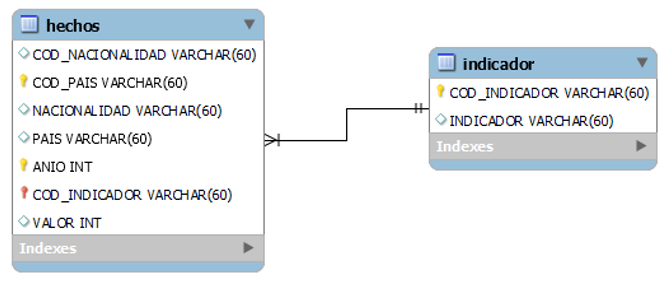

<h1 align="center"> Data engineering :gear: :construction_worker_man: </h1>

   
   

# Tabla de contenidos
* [Introducción](#Introducción)

* [Objetivo del trabajo](#Objetivo-del-trabajo)

* [Tecnologías](#Tecnologías)

* [Flujo de datos](#Flujo-de-datos)

* [Diagrama ER](#Diagrama-ER)

# Introducción
Esta semana del proyecto está relacionada en las áreas que involucran al data engineering, tenemos el desafío de crear un Data Warehouse completamente funcional que sea accesible tanto para el área de Analitycs como para el área de Machine Learning. Además, debemos tener nuestra base de datos en GCP e implementar un orquestador de flujo de datos como AirFlow.

# Objetivo del trabajo

Como objetivos en esta instancia nos planteamos:

* La construcción de una base de datos montada en GCP.
* Un pipeline que maneje el flujo de los datos, tanto su extracción, como limpieza y carga a la base de datos.
* La implementación de Airflow como orquestador de flujo de datos para automatizar los procesos.

# Tecnologías
* Google Cloud Plataform (GCP)
    + Google Cloud Storage
    + Kubernetes
    + Big Query
    + Google Cloud Composer
* Python 
    * Pandas
* Airflow    

**GCP** es una plataforma en la nube que ofrece una variedad de servicios,tales como los recursos para poder almacenar la información y encargarse de proporcionar la capacidad de cómputo necesaria para brindar un servicio constante a la base de datos y al orquestador de datos, Airflow.

**Python** y **pandas** mediante scripts se encargan de construir la estructura y aplicar los cambios necesarios para la extracción, limpieza y carga de los datos. 

**Airflow** se encarga de la automatización del proceso de ETL que mediante el uso de DAGs, se utiliza para automatizar tareas repetitivas y programar tareas en un horario específico.

# Flujo de datos

   
   

El flujo de datos implementado para este proyecto es el siguiente:

* Los datos son extraidos de la [API del Banco Mundial](https://datahelpdesk.worldbank.org/knowledgebase/topics/125589-developer-information) y son almacenados en LANDING ZONE.
* Luego, mediante  el uso de Kubernets los datos son transformados y enviados a una zona momentanea llamada STAGING ZONE y finalmente, los datos transformados se depositan en un data warehouse utilizando Big Query.
* Todo el flujo de trabajo anterior es orquestado mediante Airflow y Google Composer.
* Finalmente los datos quedan disponibles para el área de Analytics y Machine Learning, los cuales obtenen datos en tiempo real de la API.

## *Video demostrativo*
En el siguiente [link](https://drive.google.com/file/d/1RxB9IvNh5I5fbu_mHqZRDetXCHlFbuba/view?usp=sharing) se explica el flujo de datos con más detalle.

# Diagrama ER
En un principio contamos con las siguientes tres tablas.
 

   
   

La primera tabla cuenta con los indicadores socio económicos, la segunda contiene el nombre de los indicadores y la tercera trata sobre los países y los años de los respectivos indicadores.

Para el diagrama entidad-relación unimos las tablas y solo contamos con dos tablas, una de hechos en la cual se encuentra los principales indicadores a analizar con sus respectivos valores a lo largo del tiempo y la segunda tabla que es de dimensiones en la cual se encuentran los nombres de dichos indicadores.

La tabla `hechos` y la tabla `indicadores` se conectan mediante la columna 'COD_INDICATOR' común en las dos tablas, la cual indica el código del indicador socio económico.

 

   
   

